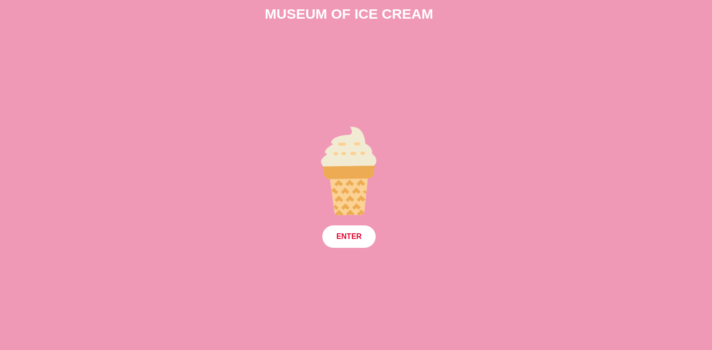
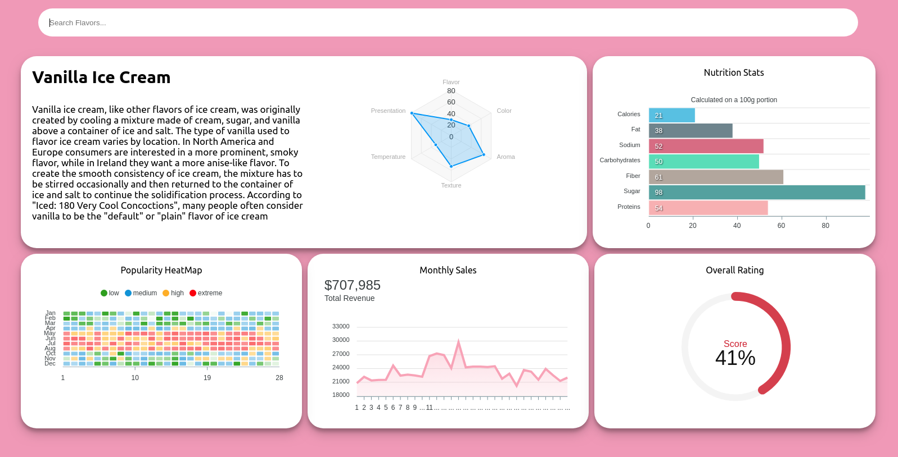
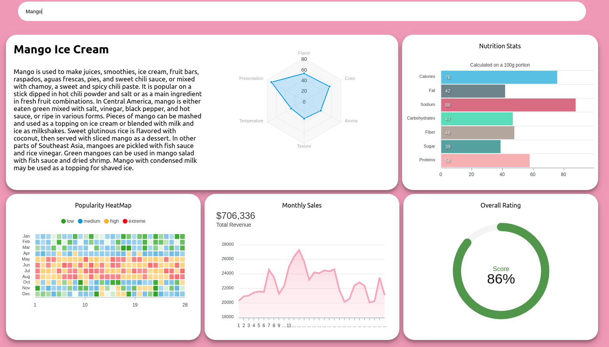

# MOIC Dashboard

## Technical Stack

MERN stack
- MongoDB (mlab)
- Express.js
- React.js
- Node.js

## An Overview

An Ice Cream flavor searching web app that includes charts and graphs and descriptions. 

## Inspiration
MOIC dev challenge

## What's next
Fixing mobile responsivness. 

## Tutorial
Download from github
 `
 git clone https://github.com/thatBrian/Museum-of-Ice-Cream-Dashboard.git
 `
 
Install modules

`
cd server
npm start
`

`
cd dashboard4
npm start
`

Head over to `localhost:3000`

